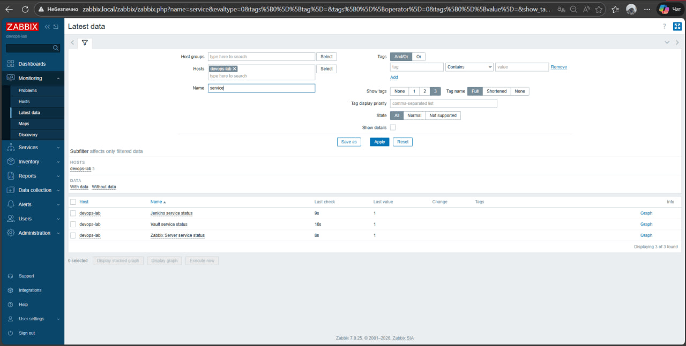

# DevOps Lab — Vagrant + Vault + Jenkins + Zabbix

Цей проєкт розгортає віртуальну машину з трьома сервісами однією командою `vagrant up`.

## Що всередині

- **HashiCorp Vault** — зберігання секретів (паролі, токени, ключі)
- **Jenkins** — CI/CD сервер для автоматизації збірки і деплою
- **Zabbix** — моніторинг сервера і сервісів

Всі сервіси встановлюються автоматично через Ansible. Ніяких ручних кроків після `vagrant up`.

## Структура проєкту
devops-lab/
├── Vagrantfile                  # Опис віртуальної машини
└── provision/
├── playbook.yml             # Головний Ansible сценарій
├── inventory.ini            # Список машин для Ansible
└── roles/
├── common/              # Базові налаштування VM
├── vault/               # Встановлення HashiCorp Vault
├── jenkins/             # Встановлення Jenkins
└── zabbix/              # Встановлення Zabbix

## Що потрібно встановити на свій комп'ютер

| Інструмент | Для чого | Посилання |
|-----------|---------|-----------|
| VirtualBox | Запускає віртуальну машину | [virtualbox.org](https://www.virtualbox.org/wiki/Downloads) |
| Vagrant | Керує віртуальною машиною | [developer.hashicorp.com/vagrant](https://developer.hashicorp.com/vagrant/install) |
| Git | Завантаження коду | [git-scm.com](https://git-scm.com/download/win) |

Перевірка що все встановлено (виконай у PowerShell):
vagrant --version
vboxmanage --version
git --version

## Запуск

### Крок 1 — Завантаж проєкт

git clone https://github.com/CHOTKYU/devops-lab.git
cd devops-lab

### Крок 2 — Додай до hosts файлу (один раз)

Відкрий Notepad від імені адміністратора і відкрий файл:

C:\Windows\System32\drivers\etc\hosts

Додай в кінець:

192.168.56.10  vault.local jenkins.local zabbix.local

### Крок 3 — Запусти VM

vagrant up

Перший запуск займає 15-20 хвилин — завантажує Debian і встановлює всі сервіси.

## Доступ до сервісів

| Сервіс | Адреса | Логін | Пароль |
|--------|--------|-------|--------|
| Vault | http://vault.local:8200 | token | див. нижче |
| Jenkins | http://jenkins.local:8080 | admin | admin123 |
| Zabbix | http://zabbix.local/zabbix | Admin | zabbix |

### Як отримати токен Vault

vagrant ssh
sudo cat /opt/vault/vault-init.json

Скопіюй значення `root_token` і використай для входу у Vault UI.

## Як записати секрет у Vault

### Через веб-інтерфейс
1. Відкрий http://vault.local:8200
2. Введи токен з `vault-init.json`
3. Натисни **secret/** → **Create secret**
4. Path: `myapp/config`
5. Додай: key=`db_password`, value=`supersecret`
6. Натисни **Save**

### Через термінал (всередині VM)

vagrant ssh
export VAULT_ADDR="http://127.0.0.1:8200"
export VAULT_TOKEN="твій-root-token"
vault kv put secret/myapp db_password="supersecret"
vault kv get secret/myapp

## Як створити job у Jenkins

1. Відкрий http://jenkins.local:8080
2. Логін: `admin` / `admin123`
3. Натисни **New Item**
4. Введи назву, вибери **Freestyle project** → OK
5. У секції **Source Code Management** вибери **Git**
6. Вкажи URL репозиторію: `https://github.com/your/repo.git`
7. Натисни **Save** → **Build Now**

## Моніторинг у Zabbix

Zabbix відстежує стан VM і сервісів:

Переглянути дані: **Monitoring → Latest data** → вибрати хост `devops-lab`
